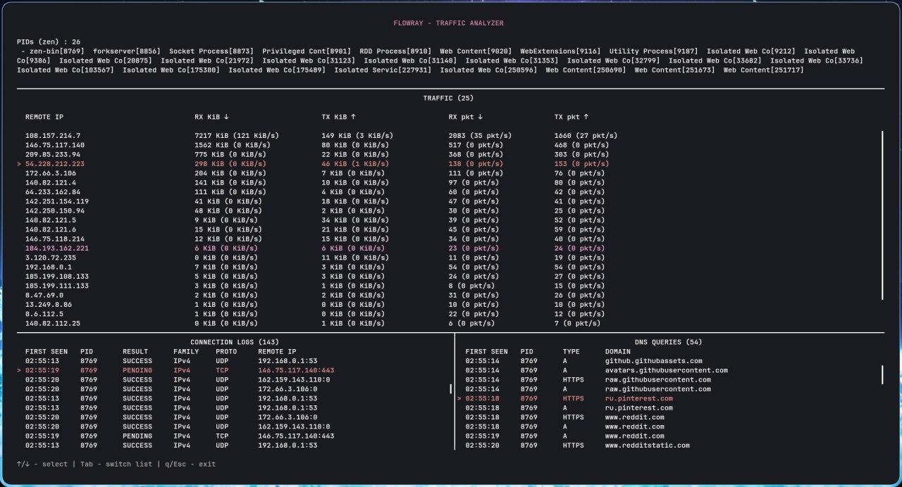
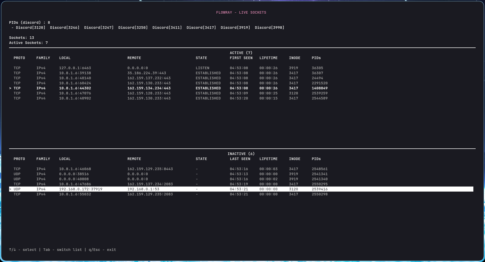

# flowray v1.0.0-1

Linux application network activity analyzer.

FlowRay tracks the network activity of a specific Linux application and shows which remote endpoints it communicates with, how much traffic is transferred, and which processes own its sockets.

It provides two monitoring backends:

- **eBPF**
- **Socket diagnostics**

## Example

Analyze your browser traffic:

```bash
./flowray --name zen --tree
```



or socket backend:

```bash
./flowray --name zen --tree --socket
```



## Requirements

### Linux

The eBPF backend requires:

- Linux 6.6+
- kernel BTF at `/sys/kernel/btf/vmlinux`
- root privileges
- Clang
- bpf

> The classic socket backend does not require eBPF or root privileges in the normal case.

### Arch Linux

Install dependencies:

```
sudo pacman -S --needed base-devel git cmake clang bpf libbpf
```

## Build

Clone and build:

```bash
git clone https://github.com/Stelour/flowray.git
cd flowray

cmake -S . -B build
cmake --build build
```

And start using it:

```bash
./build/flowray --help
```

---

### eBPF build files

If you want to generate from source, keep in mind, for eBPF need to be generated 3 files:
- ebpf/vmlinux.h
- ebpf/ebpf_connect.bpf.o
- ebpf/ebpf_connect.skel.h

They are generated automatically by CMakeLists.txt during the build.

## Usage

FlowRay requires a target selected either by PID or process name.

```text
flowray (--pid PID | --name NAME) [options]
```

### Target selection

#### `--pid, -p`

Analyze a process by PID.

```bash
sudo ./build/flowray --pid 12345
```

#### `--name, -n`

Analyze all processes matching the specified process name.

```bash
sudo ./build/flowray --name Discord
```

> `--name` may select multiple processes.

### Additional options

#### `--tree, -t`

Include descendant processes of the selected target.

```bash
sudo ./build/flowray --name Discord --tree
```

#### `--detail, -d`

Show additional connection details.

#### `--socket, -s`

Use the classic socket diagnostics backend instead of eBPF.

```bash
./build/flowray --name Discord --socket
```

#### `--live, -l`

Continuously monitor socket state changes.

This option is only available with the classic socket backend.

```bash
./build/flowray --name Discord --socket --live
```

#### `--stdout`

Print monitoring output to stdout instead of using the interactive TUI.

```bash
sudo ./build/flowray --name Discord --tree --stdout
```

#### `--ring-buffer-size SIZE`

Set the eBPF event ring buffer size in KiB. The value must be a power of two and at least `256`. Default value - 256 KiB.

```bash
sudo ./build/flowray --name Discord --ring-buffer-size 1024
```

### CLI `--help` example

```
FlowRay - linux application network activity analyzer


./flowray [OPTIONS]


OPTIONS:
  -h,     --help              Print this help message and exit
  -p,     --pid UINT Excludes: --name 
                              Analyze a process by PID
  -n,     --name TEXT Excludes: --pid 
                              Analyze all processes with the specified name
  -t,     --tree              Include descendant processes in the analysis
  -d,     --detail            Show additional connection details
  -l,     --live Needs: --socket 
                              Continuously monitor socket state changes
  -s,     --socket Excludes: --ring-buffer-size 
                              Use the classic socket diagnostics backend instead of eBPF
          --stdout            Print output to stdout instead of using the TUI
          --ring-buffer-size UINT Excludes: --socket 
                              Set the eBPF event ring buffer size in KiB (power of two, min
                              256)         
```

## FAQ

flowray via backend sockets fails after a system/kernel update

> If the Linux kernel or kernel modules were updated while the system was running, the currently running kernel may no longer match the modules installed on disk. Reboot the system and try FlowRay again.